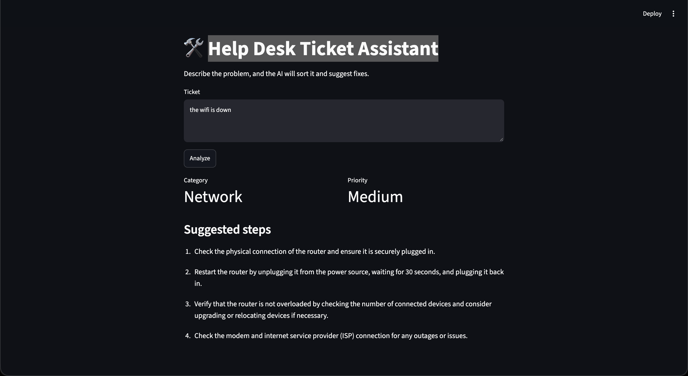

# 🛠️ Help Desk Ticket Assistant

An AI tool that reads IT help desk tickets, sorts them by **category** and **priority**, and suggests **troubleshooting steps**. It runs fully on your own computer using a local AI model, so no ticket data is sent to the cloud.



## What it does

You type a problem like *"The whole second floor has no internet."* The app returns:

- **Category:** Account, Network, Hardware, Software, or Security
- **Priority:** High (many people affected or a security risk), Medium (one person can't work), or Low (they can still work)
- **Suggested steps:** 3 to 5 troubleshooting steps

## Features

- **Web app** (`app.py`): type a ticket and get results instantly in your browser
- **Batch mode** (`Help.py`): process a whole list of tickets from `tickets.txt` and save the results to `results.csv`
- **Runs locally** with Ollama, so it's free and private
- **Consistent results** using temperature 0

## Built with

- Python
- [Ollama](https://ollama.com) with the Llama 3.2 model
- [Streamlit](https://streamlit.io) for the web page

## How to run it

1. Install [Ollama](https://ollama.com) and download the model:
   ```
   ollama pull llama3.2
   ```
2. Install the Python packages:
   ```
   pip install -r requirements.txt
   ```
3. Start the web app:
   ```
   streamlit run app.py
   ```
   Or run the batch version:
   ```
   python Help.py
   ```

## What I learned

- Writing clear prompts improved accuracy. Adding rules for what "High" or "Low" priority means fixed tickets that were being ranked too high.
- Asking the model to reply in JSON makes its answers easy for code to use.
- Small local models aren't perfect. I tested the results against expected answers to measure how well it did.

## Future ideas

- Add example tickets to the prompt to improve accuracy
- Save tickets from the web app into a queue
- Let users mark the AI's answer as right or wrong
